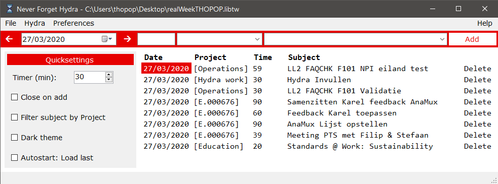
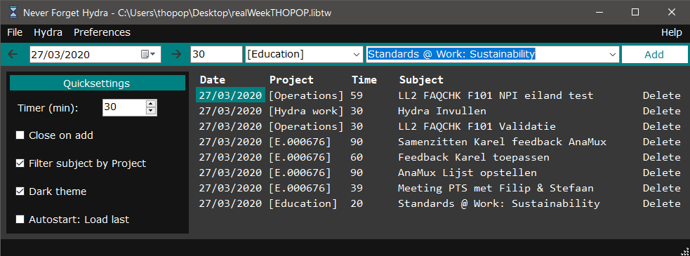

# NeverForgetHydra
## License: MIT
    Copyright 2020 Thomas Poppe

    Permission is hereby granted, free of charge, to any person obtaining a copy of this software and associated documentation files (the "Software"), to deal in the Software without restriction, including without limitation the rights to use, copy, modify, merge, publish, distribute, sublicense, and/or sell copies of the Software, and to permit persons to whom the Software is furnished to do so, subject to the following conditions:

    The above copyright notice and this permission notice shall be included in all copies or substantial portions of the Software.

    THE SOFTWARE IS PROVIDED "AS IS", WITHOUT WARRANTY OF ANY KIND, EXPRESS OR IMPLIED, INCLUDING BUT NOT LIMITED TO THE WARRANTIES OF MERCHANTABILITY, FITNESS FOR A PARTICULAR PURPOSE AND NONINFRINGEMENT. IN NO EVENT SHALL THE AUTHORS OR COPYRIGHT HOLDERS BE LIABLE FOR ANY CLAIM, DAMAGES OR OTHER LIABILITY, WHETHER IN AN ACTION OF CONTRACT, TORT OR OTHERWISE, ARISING FROM, OUT OF OR IN CONNECTION WITH THE SOFTWARE OR THE USE OR OTHER DEALINGS IN THE SOFTWARE.

# Images

## What is this
A tool made to keep track of what to fill in on **Hydra** (Citrix App) at the end of the week.
A timer makes the tool popup and requires you to fill in what you've done. At the end of the week, the user can view how much time he/she has spent on which project.
Free to use for anyone, although this repository lays its focus on offering the best functionality for Barco NV employees.

## Updates
The tool checks for updates on start.
If you want to disable it, change the code and recompile.

## PreCompiled and ready to use
Download: https://drive.google.com/open?id=1bW8nKafGaQjiept200WR01d66ibY5_MK
(On first start, update will be performed and all files will be downloaded.)

Keep in mind, this tool will be updated for use at Barco NV.
For private use, it's recommended to alter the code and compile your own version.

